## Introduction
#### In our group project we chose to analyze airline data from the US of US based carriers. The main motivation behind our project was to discover which US airline would provide the consumer with the overall best experience. We expanded our topic to try and discover how one could have the absolute best experience when travelling in the US taking into consideration the time of year, region, and airline one chooses to travel with. We chose this topic because more and more frequently these days air travel is riddled with issues and stories of massive delays, lost luggage, and poor customer experience. So by analysing our data we were trying to determine how one could avoid this in the current age of poor quality air travel.

## Highlights from E.D.A.
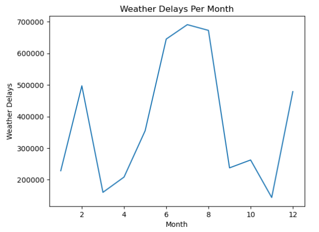
#### This is interesting because one would assume that most weather delays would happen in the winter months. Although February and December have slight upticks in weather delays the most delays occur in July and August which is very strange given that these are the months when the weather is the best which makes one think that perhaps airlines blame delays on weather when it isn't actually the cause.
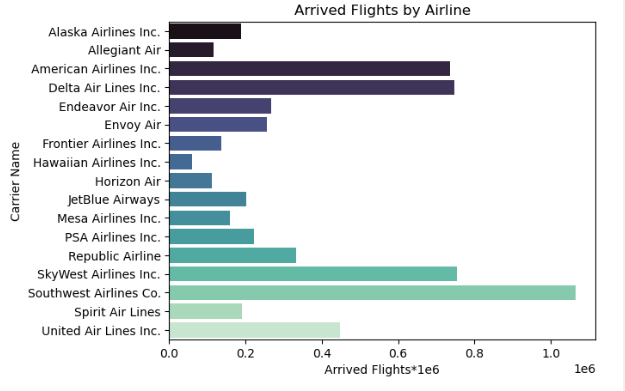
#### Southwest easily has the most flights in the US. An unsurprising statistic since they have a large fleet size and opperate on a business model that promotes fast, frequent, convienient, and cheap travel. American and Delta also have large fleets but serve many long haul routes meaning their aircraft are in the air longer and thus have less arrived flights. Skywest does not have a large fleet but opperates very short haul flights sometimes turning around the same aircraft up to 15 times in 24 hours, thus increasing the number of arrived flights for the carrier.

#### Southwest has the most late aircraft delays. As they have an extremely complicated route network and large fleet this is unsuprising. Delta and United both have comparable fleets to American Airlines and Southwest but have significantly less complicated route networks to Southwest although Americans network is comparable. This suggests that American is more suseptable to late aircraft delays then their main competitors.
## Question 1:
#### How are you most likely to reach your intended destination on time using air travel in the US? Taking things into account like departure/arrival location, airline choice, time of year etc. Or more generally, what is the absolute best time, airline, and route if you were trying to have a "perfect" trip.

#### Best Time to Travel:
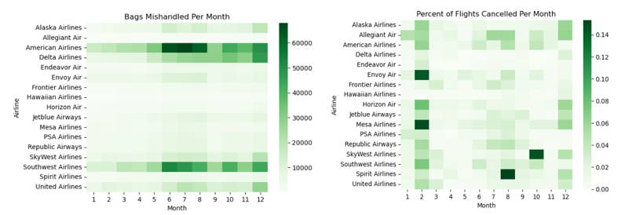
##### Based on the previous EDA, the most weather delays occur in June, July, and August. The least weather delays occur in November and March. 
##### Skywest and Spirit cancel the portion of their flights in October and August respectively. 
##### Given that October has very few weather delays, this suggests Skywest cancels flights based on inside factors that theoretically could be controlled for. 
##### To avoid the most weather delays and cancelled flights, flying Delta, Hawaiian, and Alaska in March, September, October, and November would be the best way to avoid these complications.
##### The smaller carriers mishandle the least amount of bags throughout the year. But the major airlines consistently mishandle bags throughout the year. United mishandles the least amount of bags amoung the major US airlines, and the months of January and Febuary have the least bags mishandled.
#### Best Place to Travel:
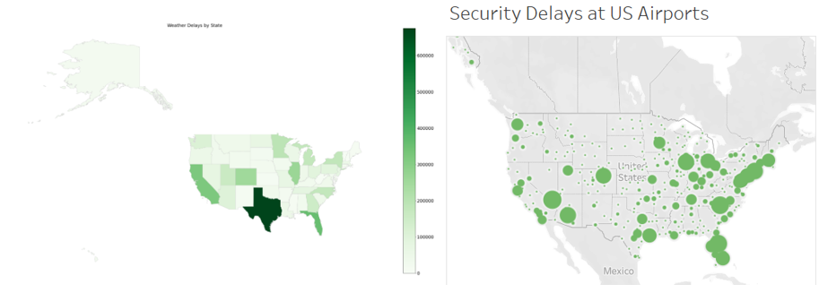
##### Among US states, the major population centres have the most weather delays: California, Texas, Florida, and New York. Texas however experienced a Winter storm in Febuary 2021 which caused an uncharacteristic increase in weather delays on flights originating in the State. Michigan and Georgia are both states that rank in the top 10 US states by population but have proportionally lower weather delays. 
##### When trying to avoid security delays at American airports, as expected smaller airports incur less delays. However, many major US cities have two or even three airports with regular service and the smaller of the major airports incur significantly less delays. For example, Chicago  O'Hare (ORD) incurred 6262 security delays with 684,200 flights, whereas Chicago Midway (MDW) incurred 2506 security delays with 456,012 flights. So, Midway has 2/3 the flights but only 1/3 the security delays.
#### Who to Travel With:
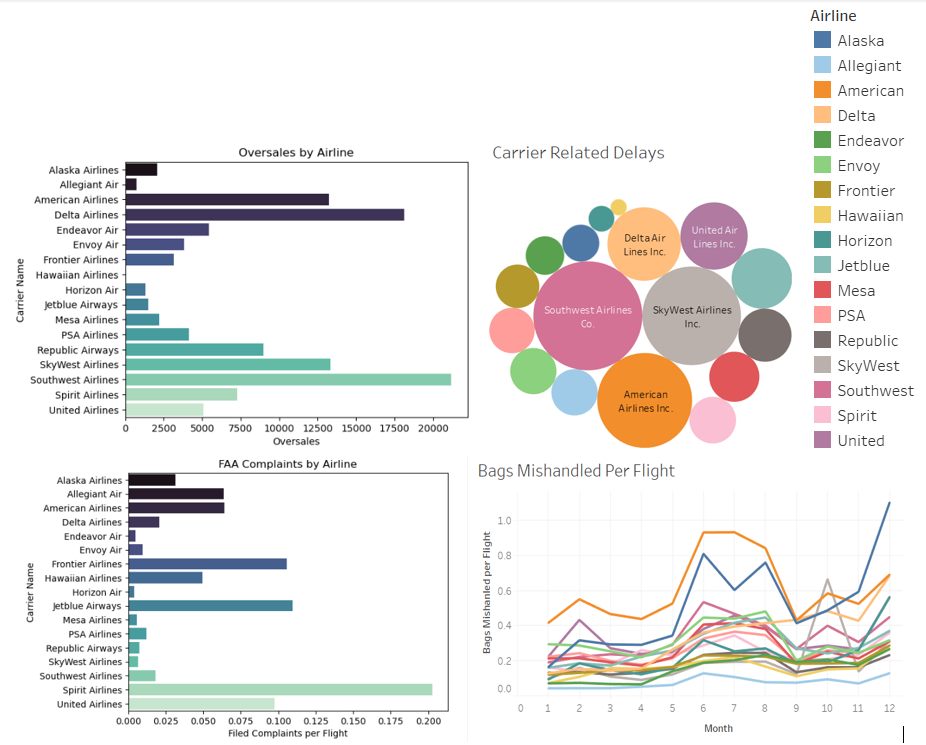
##### Oversales are caused when airlines sell more seats then are avaliable on their flights. This is completely avoidable and only serves to cause consumers to be inconvenienced. Southwest, a budget, low cost carrier, oversells the most seats in the US in order to maintain opperating revenue, the same cannot be said for Delta who sells tickets at higher prices and has a similarly sized fleet and route network. Alaska and JetBlue both operate large fleets and route networks but oversell very little in comparison to American and Delta. 
##### Spirit easily leads in customer complaints per flight, averaging one complaint every 5 flights. Compared to Frontier, who operate a similar business model averages almost exactly half the complaints. Among major carriers, Delta and Southwest have very few complaints for the vast businesses they operate. Another notable mention would be SkyWest who operate many short haul flights and don't have many customer complaints.
##### The largest airlines in the US expectidly have the most carrier related delays, such as late arrival aircraft, crew issues, maintenance delays, etc. A noteable bright spot would be Alaska, a large airline who incures a relatively low numbers of carrier related delays.
##### American Airlines consistenly mishandles the most bags per flight of any US carrier, they do have the most complicated route network which may lead to mishandled baggage but similar airlines like Delta and United are able to avoid this. 
## Question 2:
#### What airlines are the best and what are the worst at being on-time, canceled, delayed?
##### Airlines that seem to have more difficulty as assumed are the budget airlines as they seem to experience the most security delays, the most over bookings. 
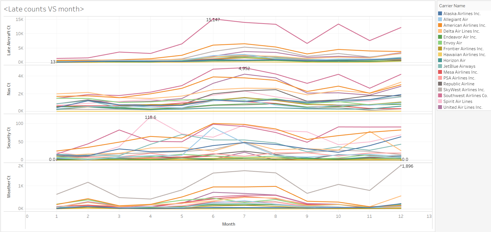

##### The FAA describes Security delays as such: [“caused by evacuation of a terminal or concorde, reboarding of aircraft because of security breach, inoperative screening equipment and/or long lines in excess of 29 minus at screening areas.”](https://aspm.faa.gov/aspmhelp/index/Types_of_Delay.html#:~:text=Security%20delay%20is%20caused%20by,29%20minutes%20at%20screening%20areas.so) In our findings we found that 17 percent of security delays are held by Spirit airlines. Which is quite substantial; they accumulated 38737 delays per year on average. Now this delay could be at mercy of the airport and its capabilities, however due to the budget airlines usage of buses to board the planes rather than jetways these security breaches happen much more often as buying gate space for budget airlines is simply not in their business model.  
#### What months are the worst to travel?
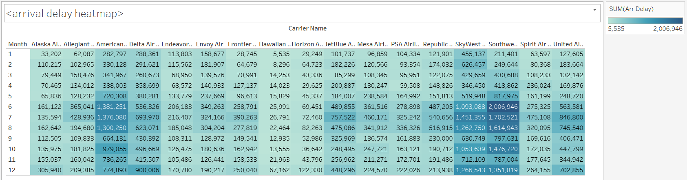
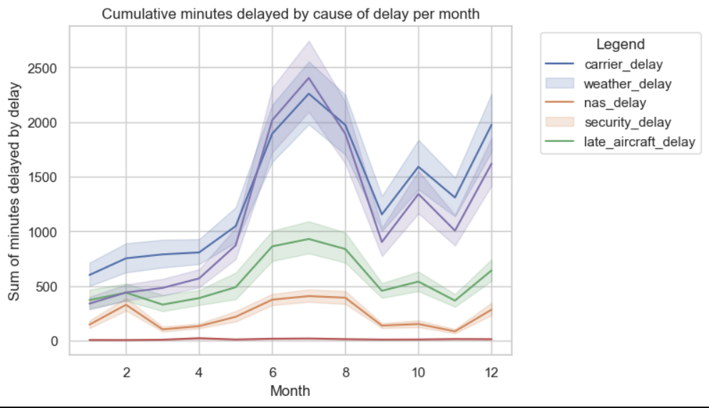
##### of course certain months are better to travel and other months are worse, For instance nearing the Summer from june to august it seems as if more delays persist than during the holiday season. This can be to blame as the airlines blame weather on more of their delays rather than just being late so their shortfalls appear during the summer months

#### Southwest observation:
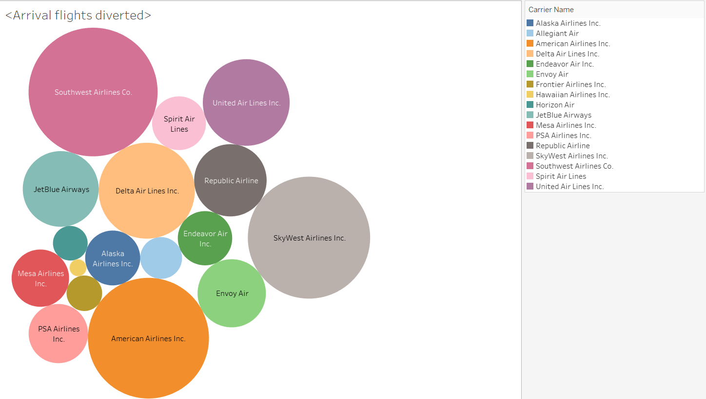
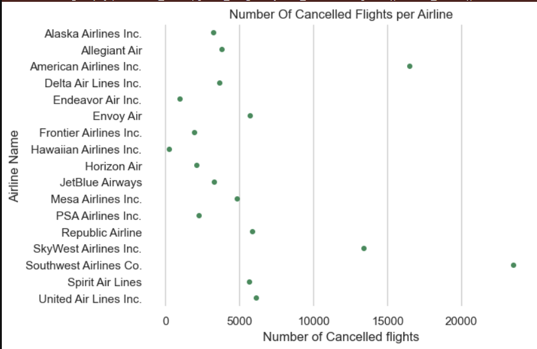
##### Looks like Southwest takes the cake here on being the worst airline, for the most part they are lightyears ahead of the competition in being the worst. american airlines with a comparable fleet size out shines Southwest as Southwest seems to have many more delays and cancellations:
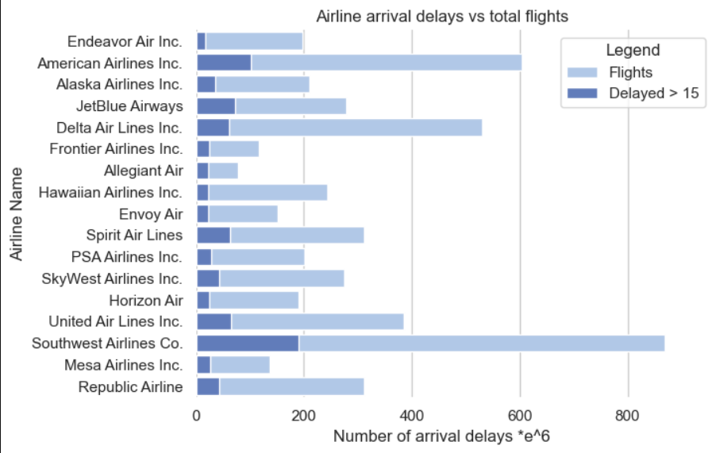
##### Over the board American Airlines is the best, because American airlines have such a robust fleet and route network, they are able to offset the effect of delays and cancellations compared to smaller airlines.

##### These delays are at the mercy of the Airport and Air Traffic control as if the plane is required to make a "Go Around" then the airline has no choice. 

##### Also Airport delays don't always mean that the Airline is delayed. It usually results in the airport being unorganized. Another factor is that this industry is a domino industry. When I say that I mean that one issue tends to cause a lot of issues and delays down the line. So Some of these metrics are duplicates due to this "Domino Effect"
### Who is the best and worst?
#####  As it is quite difficult to just compare an airline based on their numerical data as the experience of flying with each airline is different, I found a top 3 list as all of these airlines do well.
##### The top 3 are American Airlines, United Airlines and Alaska Airlines. I would say American would rank Number 1 In this top 3 list as they have so many flights that accessibility to get to your final destination is easier, and their numbers are rather stelar based on the amount of flights they have a day. As for the worst airlines to travel are Southwest, Spirit. 
### Conclusion:

##### In conclusion the perfect trip would consist of flying in March or November, through secondary airports at major US cities on Alaska Airlines. This is because the least delays happen in the aforementioned months, probably because air travel slows down in these months. At the secondary airports in major US cities, there are usually still many flights to diverse destinations without the number of delays caused by major airports. Alaska Airlines has comparably small carrier related delays and FAA complaints. They have very few oversales but do mishandle baggage frequently. The diverse route network and good service may make up for this one fault making Alaska the best choice from this analysis.

##### If you were to base your decision on just efficiency and getting from point A to point B with flight availability your best choice would be to pick American Airlines, United Airlines or Alaska Airlines. However American Airlines is the best for flight availability and flight networks as their flight availability and routes are much more than other airlines. Due to American's large fleet and their consistent track record they are the best performing airline, following suit is United and Alaska Airlines. Air Carriers to avoid are the budget airlines like Spirit airlines and Southwest due to the nature of their business model it forces large hiccups further down the road for the airline. 
